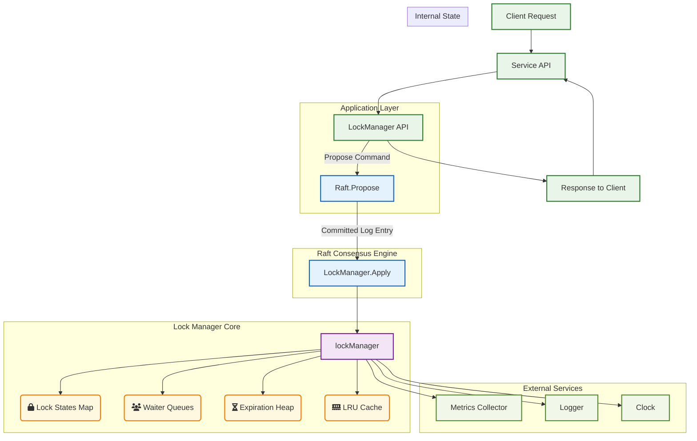

# Distributed Lock Manager (`lock/`)

The `lock` package provides a distributed lock manager built on top of the Raft consensus protocol. It is designed to serve as the application-level state machine (`Applier`) for a Raft cluster, offering distributed locking primitives essential for coordinating tasks and managing shared resources in a fault-tolerant manner.

This module ensures that lock operations (acquire, release, renew) are applied deterministically and consistently across all nodes in the cluster, providing linearizable semantics for lock state management.

-----

## Key Features

* **Distributed Locking**: Core functionality to acquire, release, and renew locks across a cluster.
* **Time-to-Live (TTL) Expiration**: Locks can be acquired with a TTL, after which they automatically expire, preventing indefinite deadlocks.
* **Waiter Queues**: Clients can wait for a lock to be released. The queue supports both FIFO and priority-based ordering.
* **Fencing Tokens**: Each lock acquisition or renewal is associated with a version number (a Raft log index), which acts as a fencing token to prevent split-brain and out-of-order operations.
* **Snapshotting**: Integrates with the Raft `Applier` interface to create and restore state machine snapshots, enabling efficient log compaction.
* **Read Caching**: An optional LRU cache can be enabled to improve the performance of read operations like `GetLockInfo`.
* **Rich Metrics**: A comprehensive `Metrics` interface allows for deep monitoring of lock operations, performance, and internal state.
* **Configurability**: Highly configurable, with options for TTL durations, waiter queue sizes, caching, and more.

-----

## Architecture

The `lock` package is architected around the central `lockManager`, which implements the `LockManager` and `raft.Applier` interfaces. It manages the state of all locks, their expiration, and client wait queues.



### Core Internal Components

* **`lockManager` (`lock.go`)**: The central struct that implements the `LockManager` interface. It holds all the state and logic for managing locks.
* **`lockState` (`lock.go`)**: A struct that represents the state of a single lock, including its owner, version (fencing token), and expiration time.
* **`expirationHeap` (`expiration.go`)**: A min-heap used to efficiently track lock expirations. The lock with the nearest expiration time is always at the root.
* **`waitQueue` (`waiter.go`)**: A priority queue for clients waiting to acquire a lock. It can be configured to order waiters by priority and then by enqueue time.
* **`LockCache` (`cache.go`)**: An optional LRU cache with TTL support to reduce latency for read-heavy workloads by caching lock information.
* **`Serializer` (`serializer.go`)**: An interface for encoding and decoding lock commands and snapshots, with a default JSON implementation.

-----

## Quick Start

Here’s a brief example of how to instantiate and use the `lockManager`.

### 1\. Initialize the Lock Manager

First, create a new `LockManager` instance. You can customize its behavior with various options.

```go
package main

import (
    "context"
    "fmt"
    "time"

    "github.com/jathurchan/raftlock/lock"
    "github.com/jathurchan/raftlock/types"
)

func main() {
    // Initialize the lock manager with custom options
    lm := lock.NewLockManager(
        lock.WithDefaultTTL(30*time.Second),
        lock.WithMaxTTL(5*time.Minute),
        lock.WithPriorityQueue(true),
        lock.WithCache(true),
        lock.WithCacheSize(1000),
    )
    defer lm.Close()

    ctx := context.Background()
    lockID := types.LockID("resource-123")
    clientID1 := types.ClientID("client-A")
    clientID2 := types.ClientID("client-B")
    version := types.Index(1)
```

### 2\. Acquire and Release a Lock

Lock operations are applied to the state machine. Here we call the methods directly for demonstration.

```go
    // --- Acquire a lock ---
    fmt.Println("Client A attempts to acquire the lock...")
    info, err := lm.ApplyAcquire(ctx, lockID, clientID1, 30*time.Second, version)
    if err != nil {
        fmt.Printf("Error acquiring lock: %v\n", err)
        return
    }
    fmt.Printf("Client A acquired lock: %+v\n", info)

    // --- Attempt to acquire a held lock ---
    fmt.Println("\nClient B attempts to acquire the same lock...")
    _, err = lm.ApplyAcquire(ctx, lockID, clientID2, 30*time.Second, version+1)
    if err != nil {
        fmt.Printf("Client B failed as expected: %v\n", err) // Expected: lock is already held
    }

    // --- Client B waits for the lock ---
    fmt.Println("\nClient B decides to wait for the lock...")
    pos, err := lm.ApplyWaitQueue(ctx, lockID, clientID2, 60*time.Second, version+1, 10)
    if err != nil {
        fmt.Printf("Client B failed to enter wait queue: %v\n", err)
    } else {
        fmt.Printf("Client B is waiting at position %d\n", pos)
    }

    // --- Release the lock ---
    fmt.Println("\nClient A releases the lock...")
    released, err := lm.ApplyRelease(ctx, lockID, clientID1, version)
    if err != nil || !released {
        fmt.Printf("Error releasing lock: %v\n", err)
    } else {
        fmt.Println("Client A released the lock successfully.")
    }
```

### 3\. Waiter Promotion

After the lock is released, the `Tick()` method (called periodically) will promote the next waiter.

```go
    // --- Trigger a Tick to promote the waiter ---
    // In a real system, Tick() is called periodically (e.g., every second).
    fmt.Println("\nTriggering a tick to promote a waiter...")
    lm.Tick(ctx)

    // --- Check the lock status ---
    info, err = lm.GetLockInfo(ctx, lockID)
    if err != nil {
        fmt.Printf("Error getting lock info: %v\n", err)
    } else {
        fmt.Printf("Lock is now held by: %s\n", info.OwnerID) // Expected: client-B
        fmt.Printf("Current lock info: %+v\n", info)
    }
}
```

-----

## Configuration (`config.go`)

The `LockManager` can be configured using the `LockManagerConfig` struct and functional options.

### Core Options

* **`DefaultTTL`**: The default time-to-live for a lock if not specified during acquisition. Default: 30s.
* **`MaxTTL`**: The maximum allowed TTL for any lock. Default: 5m.
* **`TickInterval`**: The recommended interval for calling the `Tick()` method to process expirations and timeouts. Default: 1s.
* **`MaxWaiters`**: The maximum number of clients allowed in a single lock's wait queue. Default: 100.

### Feature Flags

* **`EnablePriorityQueue`**: If true, the wait queue will order clients by priority. Otherwise, it uses FIFO ordering.
* **`EnableCache`**: If true, an in-memory LRU cache is enabled for `GetLockInfo` calls.
* **`CacheTTL`**: The time-to-live for entries in the read cache.
* **`CacheSize`**: The maximum number of items to store in the read cache.

### Dependencies

* **`WithSerializer(Serializer)`**: Sets the serializer for commands and snapshots.
* **`WithClock(raft.Clock)`**: Sets the clock for time-based operations, useful for testing.
* **`WithLogger(logger.Logger)`**: Sets the logger for internal events.
* **`WithMetrics(Metrics)`**: Sets the metrics collector.

-----

## API (`api.go`)

The `LockManager` interface defines the primary operations for interacting with the distributed lock service.

* **`Apply(ctx, index, command)`**: The entry point for applying a committed Raft command to the state machine.
* **`ApplyAcquire(ctx, lockID, clientID, ttl, version)`**: Attempts to acquire a lock.
* **`ApplyRelease(ctx, lockID, clientID, version)`**: Releases a held lock.
* **`ApplyRenew(ctx, lockID, clientID, version, ttl)`**: Renews the TTL of a held lock.
* **`ApplyWaitQueue(ctx, lockID, clientID, timeout, version, priority)`**: Adds a client to a lock's wait queue.
* **`ApplyCancelWait(ctx, lockID, clientID, version)`**: Removes a client from a wait queue.
* **`GetLockInfo(ctx, lockID)`**: Retrieves the current state of a lock.
* **`GetLocks(ctx, filter, limit, offset)`**: Returns a paginated list of locks matching a filter.
* **`Tick(ctx)`**: Advances the manager's internal clock to process expirations and waiter timeouts. This must be called periodically by an external process.
* **`Snapshot(ctx)`** and **`RestoreSnapshot(ctx, ...)`**: Methods to support the Raft `Applier` interface for log compaction.

-----

## Error Handling (`errors.go`)

The `lock` package defines several sentinel errors to allow for specific error handling by clients.

* `ErrLockHeld`: The lock is already held by another client.
* `ErrLockNotHeld`: An operation was attempted on a lock that is not currently held.
* `ErrNotLockOwner`: The client attempting to modify the lock is not its owner.
* `ErrVersionMismatch`: The provided fencing token (version) is incorrect.
* `ErrLockNotFound`: The requested lock does not exist.
* `ErrInvalidTTL`: The provided TTL is outside the configured minimum or maximum.
* `ErrWaitQueueFull`: The wait queue for the lock has reached its maximum capacity.
* `ErrNotWaiting`: A client tried to cancel a wait but was not in the queue.

-----

## Monitoring and Observability (`metrics.go`)

The `Metrics` interface provides a comprehensive set of hooks to monitor the health and performance of the lock manager. A `NoOpMetrics` implementation is provided for environments where metrics are not needed.

### Key Metrics

* **Requests**: Counters for acquire, release, renew, and wait requests (e.g., `IncrAcquireRequest`).
* **Latencies**: Histograms for the duration of various operations (e.g., `ObserveAcquireLatency`).
* **State Gauges**: Gauges for active locks and total waiters (e.g., `SetActiveLocks`).
* **Events**: Counters for significant events like lock expirations, waiter promotions, and timeouts (`IncrExpiredLock`, `IncrPromotedWaiter`).
* **Cache Performance**: Counters for cache hits, misses, evictions, and invalidations.
* **Raft/Snapshot Events**: Counters and duration observations for Raft `Apply` calls and snapshot operations.
