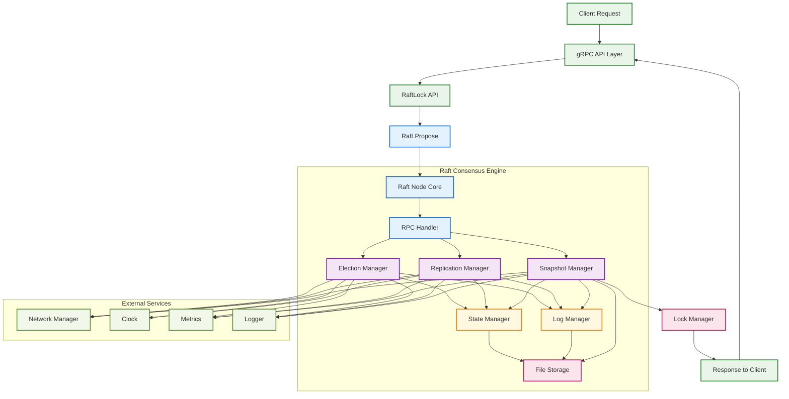

# Raft Consensus Module (`raft/`)

The `raft` package offers a robust, custom-built implementation of the Raft consensus algorithm, tailored specifically for distributed systems requiring strong consistency and fault tolerance. Designed as the core consensus engine for RaftLock—a distributed lock service—this module enables coordination across nodes to ensure linearizable operations, making it well-suited for use cases like lock management, leader election, and configuration replication.

## Overview

Raft is a consensus algorithm that enables a cluster of nodes to maintain a consistent, replicated log of operations despite node failures and network partitions. This implementation provides:

* **Leader Election**: Automatic selection of a single leader to coordinate operations
* **Log Replication**: Reliable propagation of operations across all cluster nodes
* **Safety Guarantees**: Once committed, operations are durable and consistently ordered
* **Fault Tolerance**: Operates correctly as long as a majority of nodes remain available

The module is designed with modularity in mind—application-specific logic is provided through the `Applier` interface, while networking, storage, and other concerns are abstracted through well-defined interfaces.

## Key Features

This Raft implementation includes the following key features:

### Core Raft Functionality

* **Robust Leader Election:** Implements Raft's leader election mechanism, including randomized timeouts to prevent split-vote scenarios and ensure liveness.
* **Reliable Log Replication:** The leader ensures that all nodes maintain identical operation logs through an AppendEntries RPC mechanism. Followers enforce consistency with the leader's log.
* **Log Compaction via Snapshots:** Supports creating and installing snapshots to manage log size effectively. This allows nodes to discard old log entries and enables lagging followers to catch up more efficiently.
* **Crash Recovery:** Designed for fault tolerance, enabling nodes to recover their state from persistent storage after failures and rejoin the cluster safely.

### Performance Optimizations

* **ReadIndex Protocol:** [Mechanism](#optimizations) for linearizable reads (`ReadIndex` method) without the overhead of full log replication for every read request, ensuring data consistency with reduced latency.
* **Leader Lease:** [Time-based optimization](#optimizations) (enabled by `EnableLeaderLease` flag) that allows the leader to serve `ReadIndex` requests even faster under stable network conditions by relying on a time-based lease, further reducing read latency.
* **PreVote Protocol:** [Optional Enhancement](#optimizations) (enabled by `PreVoteEnabled` flag) that helps prevent unnecessary elections and term increments in networks prone to transient partitions, improving cluster stability.
* **Batched Operations:** Log entries can be batched for replication (`MaxLogEntriesPerRequest`) and application to the state machine (`MaxApplyBatchSize`), improving throughput for write-heavy workloads.

### Production-Ready Features

* **Comprehensive Metrics:** Includes an interface for detailed operational metrics, allowing integration with monitoring systems for observing performance and debugging issues.
* **Configurable Timeouts and Intervals:** Key timing parameters like election timeouts, heartbeat intervals, and RPC timeouts are configurable to adapt to various network environments and performance requirements.
* **Graceful Shutdown:** Provides a `Stop()` method for clean resource cleanup and completion of ongoing operations.
* **Modular and Testable Design:** Core components are abstracted via interfaces (e.g., `Storage`, `NetworkManager`, `Applier`, `Clock`, `Rand`), promoting flexibility and simplifying unit testing.

## Architecture

The `raft` package employs a modular architecture centered around a `raftNode` that orchestrates specialized managers, each handling distinct aspects of the Raft algorithm. This design promotes separation of concerns, testability, and maintainability.



### Core Internal Components

#### `raftNode` (`raft.go`)

The central orchestrator of the Raft system. Implements both the public Raft API and the internal `rpcHandler` interface.

* Manages node lifecycle (`Start` / `Stop`)
* Routes RPCs to internal managers
* Propagates ticks for time-driven operations
* Manages client-facing communication channels

#### `StateManager` (`state.go`)

Maintains both **volatile** and **persistent** state of the Raft node.

**Volatile state:**

* Current role: Leader / Follower / Candidate
* Current leader ID
* Commit index and last applied index

**Persistent state:**

* Current term
* Voted-for candidate
* Interfaces with storage for durability

#### `LogManager` (`log.go`)

Abstraction layer over the Raft log, ensuring consistency and efficient access.

* Append log entries with conflict detection
* Retrieve entries by index or range
* Truncate log to resolve conflicts or compact
* Lookup terms and manage log bounds

#### `ElectionManager` (`election.go`)

Coordinates leader elections with timing and voting mechanisms.

* Randomized timeouts to reduce vote splitting
* Supports PreVote protocol
* Broadcasts vote requests and handles responses
* Manages term updates and role transitions

#### `ReplicationManager` (`replication.go`)

Handles log replication to followers, including batching and optimizations.

* Manages heartbeats to maintain leadership
* Coordinates `AppendEntries` RPCs (with batching)
* Tracks per-follower progress (`NextIndex`, `MatchIndex`)
* Supports `ReadIndex` with optional leader lease
* Advances commit index via follower acknowledgments

#### `SnapshotManager` (`snapshot.go`)

Manages the lifecycle of Raft snapshots for compaction and synchronization.

* Triggers automatic snapshots based on log size
* Captures application state via `Applier`
* Persists snapshots and tracks metadata
* Handles `InstallSnapshot` RPCs for lagging followers
* Compacts log after successful snapshot

### Key External Interfaces

#### Public API

* **`Raft`** (`api.go`)  
  The main interface exposed to applications, providing Raft control and observability.  
  **Key methods:**
  * `Start`, `Stop` – Node lifecycle
  * `Tick` – Advances Raft's internal clock
  * `Propose` – Submits commands for consensus
  * `ReadIndex` – Executes linearizable reads
  * `Status`, `ApplyChannel`, `LeaderChangeChannel` – State introspection and event streams

* **`rpcHandler`** (`api.go`)  
  Handles inbound Raft RPCs from peer nodes:
  * `RequestVote`
  * `AppendEntries`
  * `InstallSnapshot`

#### Application Integration

* **`Applier`** (`applier.go`)  
  Application-implemented interface to bridge Raft with the state machine.  
  * Applies committed log entries
  * Creates and restores snapshots

#### Other Dependencies

* **`NetworkManager`** (`network.go`)  
  Abstracts peer communication.  
  * Default: `gRPCNetworkManager`  
  * Replaceable for simulation or alternative protocols

* **`Storage`** (`storage/api.go`)  
  Interface for persisting Raft's critical state:  
  * Current term
  * Voted-for candidate
  * Log entries
  * Snapshots

* **`Clock`** (`clock.go`)  
  Time abstraction to enable mockable timing in tests.

* **`Rand`** (`rand.go`)  
  Provides randomness for election jittering (used by `ElectionManager`).

* **`Metrics`** (`metrics.go`)  
  Captures Raft metrics for observability and diagnostics.

* **`Logger`** (`logger/logger.go`)  
  Structured logging interface used throughout the Raft stack.

This modular, interface-driven design allows for highly flexible and testable Raft deployments. Individual components can be mocked or swapped to suit diverse application or infrastructure needs.

## Quick Start

This guide demonstrates how to configure, build, and operate a Raft node using our custom implementation. The example shows a simple key-value store built on top of the Raft consensus algorithm.

### 1. Implement Your Application State Machine

First, implement the `raft.Applier` interface to define how your application processes committed commands:

```go
package main

import (
    "context"
    "encoding/json"
    "fmt"
    "strings"
    "sync"

    "github.com/jathurchan/raftlock/logger"
    "github.com/jathurchan/raftlock/raft"
    "github.com/jathurchan/raftlock/storage"
    "github.com/jathurchan/raftlock/types"
)

// KeyValueStore is a simple state machine that maintains a key-value store
type KeyValueStore struct {
    mu               sync.RWMutex
    data             map[string]string
    lastAppliedIndex types.Index
    logger           logger.Logger
}

func NewKeyValueStore(logger logger.Logger) *KeyValueStore {
    return &KeyValueStore{
        data:   make(map[string]string),
        logger: logger.WithComponent("kv-store"),
    }
}

// Apply processes committed commands from the Raft log
func (kv *KeyValueStore) Apply(ctx context.Context, index types.Index, command []byte) error {
    kv.mu.Lock()
    defer kv.mu.Unlock()

    // Parse command: "SET key=value"
    cmdStr := string(command)
    parts := strings.SplitN(cmdStr, " ", 2)
    
    if len(parts) == 2 && parts[0] == "SET" {
        kv_parts := strings.SplitN(parts[1], "=", 2)
        if len(kv_parts) == 2 {
            key, value := kv_parts[0], kv_parts[1]
            kv.data[key] = value
            kv.logger.Infow("Applied SET", "key", key, "value", value, "index", index)
        }
    }

    kv.lastAppliedIndex = index
    return nil
}

// Snapshot creates a point-in-time snapshot of the state machine
func (kv *KeyValueStore) Snapshot(ctx context.Context) (types.Index, []byte, error) {
    kv.mu.RLock()
    defer kv.mu.RUnlock()

    data, err := json.Marshal(kv.data)
    if err != nil {
        return 0, nil, fmt.Errorf("failed to marshal snapshot: %w", err)
    }

    return kv.lastAppliedIndex, data, nil
}

// RestoreSnapshot restores the state machine from a snapshot
func (kv *KeyValueStore) RestoreSnapshot(ctx context.Context, lastIndex types.Index, lastTerm types.Term, data []byte) error {
    kv.mu.Lock()
    defer kv.mu.Unlock()

    var newData map[string]string
    if err := json.Unmarshal(data, &newData); err != nil {
        return fmt.Errorf("failed to unmarshal snapshot: %w", err)
    }

    kv.data = newData
    kv.lastAppliedIndex = lastIndex
    return nil
}

// Get retrieves a value (for client queries)
func (kv *KeyValueStore) Get(key string) (string, bool) {
    kv.mu.RLock()
    defer kv.mu.RUnlock()
    value, exists := kv.data[key]
    return value, exists
}
```

## 2. Configure and Build the Raft Node

Create a function to configure and build your Raft node:

```go
func createRaftNode(nodeID types.NodeID, listenAddr string, peers map[types.NodeID]raft.PeerConfig, dataDir string) (raft.Raft, *KeyValueStore, error) {
    nodeLogger := logger.NewStdLogger().WithNodeID(nodeID)
    kvStore := NewKeyValueStore(nodeLogger)

    config := raft.Config{
        ID:    nodeID,
        Peers: peers,
        Options: raft.Options{
            ElectionTickCount:     10,  // 1 second election timeout
            HeartbeatTickCount:    1,   // 100ms heartbeat interval
            SnapshotThreshold:     100, // Snapshot after 100 entries
        },
        FeatureFlags: raft.FeatureFlags{
            EnableReadIndex:   true,
            EnableLeaderLease: true,
            PreVoteEnabled:    true,
        }.WithExplicitFlags(),
    }

    storageInstance, err := storage.NewFileStorage(
        storage.Config{Dir: dataDir},
        storage.DefaultOptions(),
        nodeLogger.WithComponent("storage"),
    )
    if err != nil {
        return nil, nil, fmt.Errorf("failed to create storage: %w", err)
    }

    networkMgr, err := raft.NewGRPCNetworkManager(  // for peer communication
        nodeID,
        listenAddr,
        peers,
        nodeLogger.WithComponent("network"),
        raft.NewNoOpMetrics(),
        raft.NewStandardClock(),
        raft.DefaultGRPCNetworkManagerOptions(),
    )
    if err != nil {
        return nil, nil, fmt.Errorf("failed to create network manager: %w", err)
    }

    node, err := raft.NewRaftBuilder().
        WithConfig(config).
        WithApplier(kvStore).
        WithStorage(storageInstance).
        WithNetworkManager(networkMgr).
        WithLogger(nodeLogger).
        WithMetrics(raft.NewNoOpMetrics()).
        WithClock(raft.NewStandardClock()).
        WithRand(raft.NewStandardRand()).
        Build()

    return node, kvStore, err
}
```

### 3. Start and Operate the Raft Node

The main function demonstrates how to start a node and interact with it:

```go
func main() {
    // Configuration for a 3-node cluster
    nodeID := types.NodeID("node-1")
    listenAddr := "localhost:8001"
    dataDir := "/tmp/raft-node1"

    // Define all peers in the cluster
    peers := map[types.NodeID]raft.PeerConfig{
        "node-1": {ID: "node-1", Address: "localhost:8001"},
        "node-2": {ID: "node-2", Address: "localhost:8002"},
        "node-3": {ID: "node-3", Address: "localhost:8003"},
    }

    // Create and start the Raft node
    node, kvStore, err := createRaftNode(nodeID, listenAddr, peers, dataDir)
    if err != nil {
        log.Fatalf("Failed to create Raft node: %v", err)
    }

    if err := node.Start(); err != nil {
        log.Fatalf("Failed to start Raft node: %v", err)
    }
    defer node.Stop(context.Background())

    log.Printf("Raft node %s started on %s", nodeID, listenAddr)

    // Start the tick loop to drive Raft's internal timers
    go func() {
        ticker := time.NewTicker(raft.NominalTickInterval) // 100ms
        defer ticker.Stop()
        for range ticker.C {
            node.Tick(context.Background())
        }
    }()

    // Process committed entries from Raft
    go func() {
        for msg := range node.ApplyChannel() {
            if msg.CommandValid {
                log.Printf("Applied command at index %d: %s", 
                    msg.CommandIndex, string(msg.Command))
            }
        }
    }()

    // Example: Propose operations if this node becomes leader
    time.Sleep(2 * time.Second) // Allow time for leader election

    commands := []string{
        "SET greeting=hello",
        "SET counter=1",
        "SET status=active",
    }

    for _, cmd := range commands {
        _, isLeader := node.GetState()
        if isLeader {
            index, term, stillLeader, err := node.Propose(context.Background(), []byte(cmd))
            if err == nil && stillLeader {
                log.Printf("Proposed '%s' at index %d, term %d", cmd, index, term)
            }
        }
        time.Sleep(1 * time.Second)
    }

    // Keep running
    select {}
}
```

### Running a Multi-Node Cluster

To run a complete cluster, start each node with different configurations:

```bash
# Terminal 1 - Node 1
go run main.go -node-id=node-1 -listen=localhost:8001 -data-dir=/tmp/raft-node1

# Terminal 2 - Node 2  
go run main.go -node-id=node-2 -listen=localhost:8002 -data-dir=/tmp/raft-node2

# Terminal 3 - Node 3
go run main.go -node-id=node-3 -listen=localhost:8003 -data-dir=/tmp/raft-node3
```

### Expected Behavior

* One node will be elected leader and handle proposals
* Commands are replicated to all nodes before being applied
* State persists across node restarts
* If the leader fails, a new election occurs automatically

This example provides a foundation for building distributed systems that require strong consistency and fault tolerance.

## Configuration (`config.go`)

The Raft node's behavior is controlled via the `Config` struct, which includes settings for timing, features, and performance tuning. Sensible defaults are often provided (see `raft/constants.go`).

### Core Options

Defines fundamental Raft operational parameters:

```go
type Options struct {
    ElectionTickCount     int           // Ticks follower waits before starting election (default: 10).
    HeartbeatTickCount    int           // Ticks leader waits between sending heartbeats (default: 1).
    MaxLogEntriesPerRequest int         // Max log entries in one AppendEntries RPC (default: 100).
    SnapshotThreshold     int           // Log entries since last snapshot to trigger new one (default: 10000).
    ApplyEntryTimeout     time.Duration // Max time to apply one log entry to state machine (default: 5s).
    FetchEntriesTimeout   time.Duration // Max time to fetch log entries from storage (default: 5s).
    LogCompactionMinEntries int         // Min log entries after snapshot before compaction (default: 5000).
    // StorageSyncDelay and ApplyTickCount have defaults but their usage might vary based on specific logic.
}
```

*[Source: `raft/config.go`]*

### Feature Flags

Toggles for enabling/disabling specific Raft protocol optimizations:

```go
type FeatureFlags struct {
    EnableReadIndex   bool // Enables ReadIndex protocol for linearizable reads (default: true).
    EnableLeaderLease bool // Enables leader lease for faster ReadIndex (default: true).
    PreVoteEnabled    bool // Enables PreVote phase to prevent needless elections (default: true).
}
```

Call `WithExplicitFlags()` on a `FeatureFlags` struct to mark that these have been intentionally set by the user, preventing them from being overridden by internal defaults if the struct itself was provided.
*[Source: `raft/config.go`]*

### Tuning Parameters

Advanced settings for performance adjustments:

```go
type TuningParams struct {
    MaxApplyBatchSize    int // Max entries applied to state machine in one batch (default: 10).
    MaxSnapshotChunkSize int // Max snapshot data chunk size in bytes for InstallSnapshot RPCs (default: 0, meaning no chunking).
}
```

*[Source: `raft/config.go`]*

## Error Handling

The `raft` package defines specific error variables in `raft/errors.go` to allow for robust error checking and handling by applications.

```go
var (
    ErrNotLeader         = errors.New("raft: node is not the leader")
    ErrTimeout           = errors.New("raft: operation timed out")
    ErrShuttingDown      = errors.New("raft: raft node is shutting down")
    ErrLeadershipLost    = errors.New("raft: leadership lost during operation")
    ErrQuorumUnreachable = errors.New("raft: quorum unreachable")
    ErrCompacted         = errors.New("raft: required log entries are compacted")
    ErrNotFound          = errors.New("raft: item not found")
    // ... and other errors like ErrTermMismatch, ErrLogConflict, etc.
)
```

*[Source: `raft/errors.go`]*

## Monitoring and Observability

### Metrics Interface

The `Metrics` interface (`raft/metrics.go`) allows integration with monitoring systems by providing hooks to record various operational data. A no-operation implementation (`NewNoOpMetrics()`) is available if detailed metrics are not needed.

```go
type Metrics interface {
    ObserveCommitIndex(index types.Index)
    ObserveAppliedIndex(index types.Index)
    ObserveTerm(term types.Term)
    ObserveLeaderChange(newLeader types.NodeID, term types.Term)
    ObserveElectionStart(term types.Term, reason ElectionReason)
    ObserveProposal(success bool, reason ProposalResult)
    // ... plus many other methods for observing log, snapshot, replication, and internal events.
}
```

### Status Information

Retrieve a snapshot of the node's current state for diagnostics or monitoring using `Raft.Status()`.

```go
status := raftNode.Status() // raftNode is your raft.Raft instance
fmt.Printf("Node ID: %s, Role: %s, Term: %d, Leader: %s\n",
    status.ID, status.Role, status.Term, status.LeaderID)
fmt.Printf("Log: LastIndex=%d (Term %d), CommitIndex: %d, LastApplied: %d\n",
    status.LastLogIndex, status.LastLogTerm, status.CommitIndex, status.LastApplied)
fmt.Printf("Snapshot: Index=%d, Term=%d\n",
    status.SnapshotIndex, status.SnapshotTerm)
// status.Replication map contains per-peer replication state if leader.
```

The `types.RaftStatus` struct provides a comprehensive view of the node's state.

## Optimizations

### ReadIndex for Linearizable Reads

Achieve strongly consistent reads using `Raft.ReadIndex()`. This confirms leadership and returns a commit index. Your application must then wait for its state machine to apply entries up to this index before reading its state.

```go
commitIndex, err := raftNode.ReadIndex(context.Background())
if err != nil {
    // Handle error (e.g., not leader, timeout)
    log.Fatalf("ReadIndex failed: %v", err)
}
// Application logic: ensure state machine reflects 'commitIndex'
// then read from local application state.
log.Printf("Linearizable read possible up to commit index %d\n", commitIndex)
```

### Leader Lease Optimization

If `EnableLeaderLease` and `EnableReadIndex` are active (`raft/config.go`), the leader can serve `ReadIndex` requests based on a time lease without contacting a quorum, reducing latency.

```go
// In your Raft Config:
config.FeatureFlags = raft.FeatureFlags{
    EnableReadIndex:   true,
    EnableLeaderLease: true,
}.WithExplicitFlags()
```

### PreVote Protocol

Enable `PreVoteEnabled` in `FeatureFlags` (`raft/config.go`) to reduce disruptive elections in unstable networks. Candidates will first "pre-vote" to check if they can win before incrementing their term.

```go
// In your Raft Config:
config.FeatureFlags = raft.FeatureFlags{
    PreVoteEnabled: true,
}.WithExplicitFlags()
```

---

For detailed implementation notes and algorithm specifics, refer to the original Raft paper: "In Search of an Understandable Consensus Algorithm" by Diego Ongaro and John Ousterhout.
