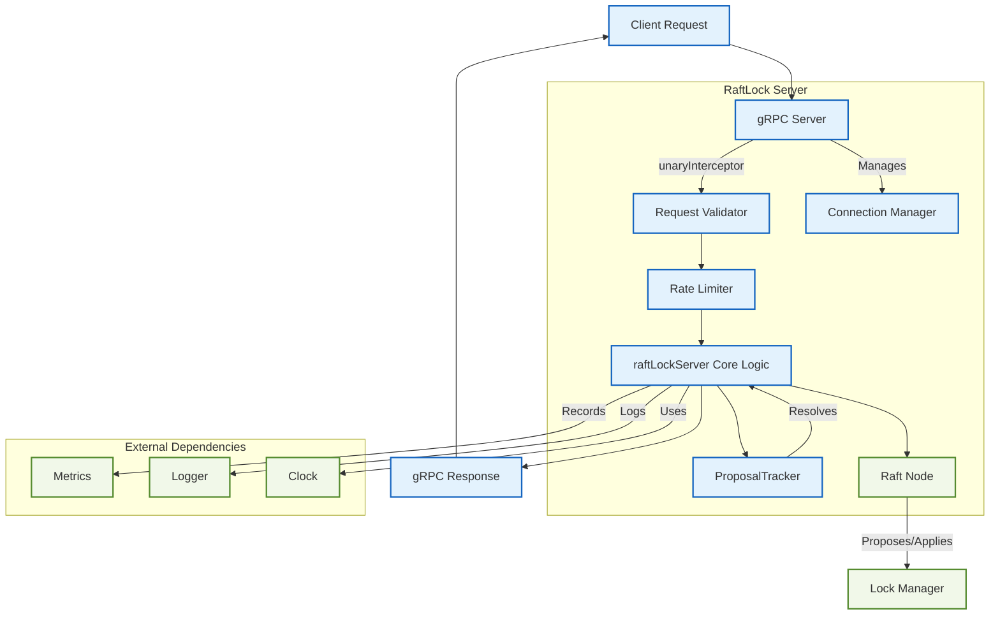

# README for the `server` Package

## Overview

The `server` package provides the gRPC server implementation for the RaftLock distributed locking service. It acts as the primary entry point for clients, handling API requests, ensuring operational integrity, and coordinating with the underlying Raft consensus module to provide strongly consistent, fault-tolerant locking.

This package orchestrates all high-level server functionalities, including request validation, rate limiting, leader redirection, connection management, and state monitoring. It is designed to be configurable and observable for production environments.

## Key Features

* **gRPC API Endpoint**: Exposes the complete distributed locking functionality through a robust, type-safe gRPC interface.
* **Leader Redirection**: Automatically forwards write requests to the current Raft leader if a request is received by a follower, ensuring clients can connect to any node.
* **Request Validation**: Enforces strict validation on all incoming requests for fields like lock IDs, client IDs, TTLs, and metadata to ensure data integrity and prevent malformed operations.
* **Concurrency and Rate Limiting**: Manages server load through configurable limits on concurrent requests and a token-bucket rate limiter to prevent abuse.
* **Graceful Shutdown**: Ensures a clean shutdown process, completing in-flight requests and closing resources within a configurable timeout.
* **Comprehensive Health Checks**: Provides a `Health` endpoint for load balancers and monitoring systems to check the server's operational status.
* **Connection Management**: Tracks active client connections for observability and debugging.
* **Pluggable Dependencies**: Uses interfaces for core dependencies like logging (`Logger`) and metrics (`ServerMetrics`), allowing for easy integration with external systems.

## Architecture

The `server` package is built around the `raftLockServer`, which integrates several key components to manage client requests and interact with the Raft consensus layer.



* **gRPC Server**: The public-facing endpoint that receives all client API calls. It uses a unary interceptor to apply common middleware.
* **Request Validator**: The first step in the middleware chain, ensuring all request parameters are well-formed and within defined limits before further processing.
* **Rate Limiter**: Protects the server from excessive traffic by enforcing a requests-per-second limit.
* **`raftLockServer` Core**: The central component that implements the `RaftLockServer` interface. It handles business logic, determines if the node is the leader, and prepares commands for Raft consensus.
* **`ProposalTracker`**: Manages the lifecycle of commands submitted to Raft. It tracks a proposal from submission until the corresponding log entry is applied, ensuring the client receives a response.
* **`ConnectionManager`**: Monitors active client connections, tracking metadata like connection time and last activity for observability.

## Quick Start

The `RaftLockServerBuilder` provides a fluent API for configuring and constructing a server instance.

1. **Use the Builder to Configure the Server**: The builder pattern helps ensure all required fields are set.

    ```go
    package main

    import (
        "context"
        "log"
        "time"

        "github.com/jathurchan/raftlock/raft"
        "github.com/jathurchan/raftlock/server"
        "github.com/jathurchan/raftlock/types"
    )

    func main() {
        nodeID := types.NodeID("node-1")
        dataDir := "/tmp/raftlock-1"

        // Define all peers in the cluster, including the current node.
        peers := map[types.NodeID]raft.PeerConfig{
            "node-1": {ID: "node-1", Address: "localhost:8081"},
            "node-2": {ID: "node-2", Address: "localhost:8082"},
            "node-3": {ID: "node-3", Address: "localhost:8083"},
        }

        // Use the builder to construct the server
        s, err := server.NewRaftLockServerBuilder().
            WithNodeID(nodeID).
            WithPeers(peers).
            WithDataDir(dataDir).
            WithClientAPIAddress("localhost:9090"). // Address for client connections
            WithTimeouts(30*time.Second, 10*time.Second, 5*time.Second).
            WithLimits(4*1024*1024, 4*1024*1024, 1000).
            Build()

        if err != nil {
            log.Fatalf("Failed to build server: %v", err)
        }

        // Start the server
        ctx := context.Background()
        if err := s.Start(ctx); err != nil {
            log.Fatalf("Failed to start server: %v", err)
        }

        log.Printf("Server %s started, listening for clients on localhost:9090", nodeID)

        // Wait for shutdown signal (e.g., from OS)
        <-ctx.Done()

        // Stop the server gracefully
        shutdownCtx, cancel := context.WithTimeout(context.Background(), 10*time.Second)
        defer cancel()
        if err := s.Stop(shutdownCtx); err != nil {
            log.Fatalf("Server shutdown failed: %v", err)
        }

        log.Println("Server stopped gracefully")
    }
    ```

2. **Use `RaftLockServerQuickBuild` for Simplicity**: For tests or simple setups, this helper function configures a server with common defaults.

    ```go
    // QuickBuild provides a simpler alternative to the full builder
    s, err := server.RaftLockServerQuickBuild(
        nodeID,
        "localhost:8081", // Raft peer address
        peers,
        dataDir,
    )
    ```

-----

## Configuration (`config.go`)

The server's behavior is controlled by the `RaftLockServerConfig` struct. While the builder provides sensible defaults, you can customize these settings:

* **`NodeID`**: The unique ID for this node. **(Required)**
* **`ListenAddress`**: The address for internal Raft peer-to-peer communication.
* **`ClientAPIAddress`**: The address for the public client-facing gRPC API.
* **`Peers`**: A map of all nodes in the Raft cluster. **(Required)**
* **`DataDir`**: The directory for storing Raft logs and snapshots. **(Required)**
* **`RequestTimeout`**: The default timeout for client requests.
* **`ShutdownTimeout`**: The grace period for the server to shut down.
* **`MaxConcurrentReqs`**: The maximum number of requests to process simultaneously.
* **`EnableRateLimit`**: A boolean to enable or disable the rate limiter.
* **`RateLimit` / `RateLimitBurst` / `RateLimitWindow`**: Parameters for the token bucket rate limiter.
* **`HealthCheckInterval`**: The frequency of internal health checks.
* **`Logger`, `Metrics`, `Clock`, `Serializer`**: Interfaces for injecting custom dependencies.

### Error Handling (`errors.go`)

The `server` package defines several custom error types to provide clear, actionable feedback to clients and operators:

* **`ErrServerNotStarted` / `ErrServerStopped`**: Returned when requests are received before the server is running or after it has shut down.
* **`ErrNotLeader` / `ErrNoLeader`**: Indicates that a write operation was sent to a non-leader node or that no leader is currently elected.
* **`LeaderRedirectError`**: A special error type returned by followers that contains the address of the current leader, allowing clients to redirect their requests.
* **`ValidationError`**: Returned when a request fails validation. It includes the field, value, and a message explaining the failure.
* **`ServerError`**: A generic error for internal issues, which can wrap an underlying cause.

The `ErrorToProtoError` function translates these Go errors into detailed `pb.ErrorDetail` messages for gRPC responses.

## Monitoring and Observability (`metrics.go`)

The `ServerMetrics` interface provides a comprehensive set of hooks to monitor the server's health and performance. You can implement this interface to integrate with systems like Prometheus, Datadog, or InfluxDB.

Key metrics include:

* **RPC-level counters**: `IncrGRPCRequest`, `ObserveRequestLatency`
* **Raft-related counters**: `IncrRaftProposal`, `ObserveRaftProposalLatency`, `IncrLeaderRedirect`
* **Error counters**: `IncrValidationError`, `IncrClientError`, `IncrServerError`
* **Gauges**: `SetServerState`, `SetActiveConnections`, `SetRaftTerm`, `SetRaftCommitIndex`

A `NoOpServerMetrics` implementation is provided for environments where metrics are not needed.
