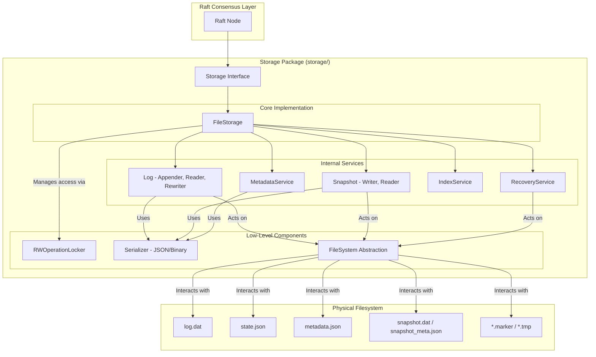

# RaftLock Storage Package (`storage/`)

## 1\. Overview

The **`storage`** package provides a durable, thread-safe, and crash-resilient persistence layer for RaftLock. It is responsible for storing all critical Raft data on the local filesystem, including the persistent state (term and vote), log entries, and snapshots.

Designed for high performance and reliability, this package uses atomic file operations, fine-grained locking, and a self-healing recovery mechanism to ensure data consistency, even in the event of sudden crashes or concurrent access. It serves as the foundation for the Raft consensus algorithm, guaranteeing that state can be reliably recovered after a node restart.

## 2\. Key Features

The `storage` package is engineered for robustness, performance, and operational insight.

* **Atomic and Crash-Safe Operations**: All critical writes to disk for state, logs, and snapshots use a *temporary file + atomic rename* strategy. This prevents partial writes and data corruption, ensuring that the storage can recover to a consistent state after a crash.
* **High Concurrency with Fine-Grained Locking**: The system uses separate read-write mutexes for state, log, and snapshot operations, allowing concurrent reads and safe, isolated writes. This minimizes lock contention and improves throughput.
* **Performance Optimizations**:
  * **Efficient Binary Format**: Log entries can be serialized into a compact binary format for reduced disk space and faster I/O, which is enabled by default.
  * **Fast Log Lookups**: An optional in-memory index map provides O(log n) access to log entries by mapping an index to its byte offset in the log file, avoiding slow sequential scans.
  * **Asynchronous Log Compaction**: To avoid blocking critical operations, log truncation after a snapshot is saved can be performed in a background goroutine.
* **Automated Recovery**: On startup, the service automatically checks for recovery markers left by incomplete operations. It can recover from failed snapshot writes and repair inconsistencies between the log and its metadata, ensuring a clean start.
* **Built-in Metrics and Observability**: When enabled, the package collects detailed performance metrics, including operation counts, latencies (average, max, P95, P99), data throughput, and error rates. A human-readable summary is available to aid in monitoring and diagnostics.
* **Flexible Configuration**: Behavior can be tuned via feature flags and options, allowing operators to enable or disable features like atomic writes, the index map, metrics, and fsync behavior to match specific performance and durability requirements.

## 3\. Architecture and Design

The `storage` package is built around the `FileStorage` struct, which implements the `Storage` interface. It coordinates a set of specialized services, each responsible for a distinct aspect of persistence.



### Components

* **`FileStorage`**: The central struct that orchestrates all operations. It manages the locks, in-memory state (like log indices), and delegates tasks to the appropriate internal services.
* **`Storage` Interface**: The public API for the package, defining all persistence operations required by the Raft algorithm.
* **Log Services**:
  * `logAppender`: Handles the validation and atomic appending of new entries to the log file.
  * `logEntryReader`: Reads and deserializes log entries, either sequentially or from a specific offset.
  * `logRewriter`: Rebuilds the log file during compaction (truncation) by writing only the necessary entries to a new file.
* **Snapshot Services**:
  * `snapshotWriter`: Manages the atomic creation of snapshot data and metadata files.
  * `snapshotReader`: Reads and validates the latest snapshot from disk.
* **`RecoveryService`**: Implements the startup logic to detect and recover from crashes, cleaning up temporary files and restoring consistency between the log, metadata, and snapshots.
* **`IndexService`**: Manages the in-memory index-to-offset map. It is responsible for building the map from the log file on startup and verifying its consistency.
* **`RWOperationLocker`**: A wrapper around `sync.RWMutex` that adds optional timeouts for lock acquisition to prevent deadlocks and tracks slow operations for metrics.
* **`Serializer`**: An interface for encoding and decoding data structures. Two implementations are provided: `jsonSerializer` and a more performant `binarySerializer` for log entries.

### File Layout

All data is stored within a single directory specified in `StorageConfig`. The typical file layout is as follows:

* `state.json`: Stores the node's persistent Raft state (current term and voted-for candidate).
* `log.dat`: The main log file containing all Raft log entries, typically in a binary format.
* `metadata.json`: A small file containing the first and last log indices stored in `log.dat`.
* `snapshot.dat`: The raw, compacted state machine data from the latest snapshot.
* `snapshot_meta.json`: JSON file with metadata for the snapshot, including its last included index and term.
* `*.tmp`: Temporary files used during atomic write operations to prevent corruption.
* `recovery.marker`: A marker file created on startup and removed on successful initialization. Its presence indicates a potential crash during the previous run.
* `snapshot.marker`: A marker file that tracks the progress of a snapshot operation, used for recovery if a crash occurs mid-snapshot.

## 4\. Public API

The `Storage` interface is the primary entry point for all persistence operations.

```go
type Storage interface {
    // Save and load persistent state (term, vote).
    SaveState(ctx context.Context, state types.PersistentState) error
    LoadState(ctx context.Context) (types.PersistentState, error)

    // Append and retrieve log entries.
    AppendLogEntries(ctx context.Context, entries []types.LogEntry) error
    GetLogEntries(ctx context.Context, start, end types.Index) ([]types.LogEntry, error)
    GetLogEntry(ctx context.Context, index types.Index) (types.LogEntry, error)

    // Truncate the log for compaction or conflict resolution.
    TruncateLogPrefix(ctx context.Context, index types.Index) error
    TruncateLogSuffix(ctx context.Context, index types.Index) error

    // Save and load snapshots.
    SaveSnapshot(ctx context.Context, meta types.SnapshotMetadata, data []byte) error
    LoadSnapshot(ctx context.Context) (types.SnapshotMetadata, []byte, error)

    // Get log boundaries without I/O.
    FirstLogIndex() types.Index
    LastLogIndex() types.Index

    // Manage observability and metrics.
    GetMetrics() map[string]uint64
    GetMetricsSummary() string
    ResetMetrics()

    // Cleanly shut down the storage layer.
    Close() error
}
```

## 5\. Configuration

Configuration is managed through two primary structs: `StorageConfig` for essential parameters and `FileStorageOptions` for fine-tuning.

### `StorageConfig`

```go
type StorageConfig struct {
    // The root directory where all storage files will be persisted.
    Dir string
}
```

### `FileStorageOptions`

This struct provides detailed control over the storage engine's behavior. The `DefaultFileStorageOptions()` function provides a sensible default for production use.

```go
type FileStorageOptions struct {
    // Feature flags for enabling/disabling specific optimizations.
    Features StorageFeatureFlags

    // Automatically truncate the log after a snapshot is successfully saved.
    AutoTruncateOnSnapshot bool

    // Force an fsync to disk after each log append operation for maximum durability.
    SyncOnAppend bool

    // The strategy to use for recovering from a potentially corrupted state.
    RecoveryMode recoveryMode

    // The minimum number of log entries to retain after a prefix truncation.
    RetainedLogSize uint64

    // The buffer size (in bytes) for chunked I/O operations.
    ChunkSize int

    // The timeout (in seconds) for acquiring a lock.
    LockTimeout int
    
    // The maximum duration to wait for a log truncation to complete.
    TruncationTimeout time.Duration
}
```

## 6\. Quick Start

Here is a basic example of how to initialize and use the `FileStorage`.

```go
package main

import (
    "context"
    "fmt"
    "log"
    "os"
    
    "github.com/jathurchan/raftlock/logger"
    "github.com/jathurchan/raftlock/storage"
    "github.com/jathurchan/raftlock/types"
)

func main() {
    // 1. Set up a directory for storage.
    dir, err := os.MkdirTemp("", "raft_storage_example")
    if err != nil {
        log.Fatalf("Failed to create temp dir: %v", err)
    }
    defer os.RemoveAll(dir)

    // 2. Configure and create a new storage instance.
    cfg := storage.StorageConfig{Dir: dir}
    opts := storage.DefaultFileStorageOptions() // Use recommended defaults
    store, err := storage.NewFileStorageWithOptions(cfg, opts, logger.NewNoOpLogger())
    if err != nil {
        log.Fatalf("Failed to create storage: %v", err)
    }
    defer store.Close()

    ctx := context.Background()

    // 3. Save and load persistent state.
    state := types.PersistentState{CurrentTerm: 1, VotedFor: "node-A"}
    if err := store.SaveState(ctx, state); err != nil {
        log.Fatalf("Failed to save state: %v", err)
    }
    
    loadedState, err := store.LoadState(ctx)
    if err != nil {
        log.Fatalf("Failed to load state: %v", err)
    }
    fmt.Printf("Loaded State -> Term: %d, VotedFor: %s\n", loadedState.CurrentTerm, loadedState.VotedFor)

    // 4. Append and retrieve log entries.
    entries := []types.LogEntry{
        {Index: 1, Term: 1, Command: []byte("set x 1")},
        {Index: 2, Term: 1, Command: []byte("set y 2")},
    }
    if err := store.AppendLogEntries(ctx, entries); err != nil {
        log.Fatalf("Failed to append entries: %v", err)
    }
    
    fmt.Printf("Log contains entries from index %d to %d\n", store.FirstLogIndex(), store.LastLogIndex())

    // 5. View performance metrics.
    fmt.Println("\n--- Metrics Summary ---")
    fmt.Println(store.GetMetricsSummary())
}
```
